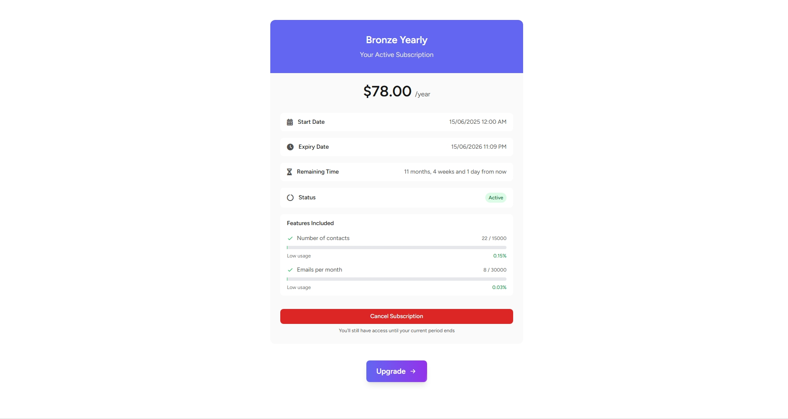

# Laravel-Livewire-Membership-System-Email-Marketing-Campaign

## Overview
A powerful email marketing platform built with Laravel and Livewire that enables businesses to manage subscribers, create beautiful email templates, send campaigns, and track performance. The system includes membership management with subscription tiers, comprehensive bounce handling, and a robust permission system.


## Technical Features

- Built with Laravel 11 and Livewire
- Alpine.js for frontend interactivity
- TinyMCE and CodeMirror for advanced content editing
- Real-time preview for email templates
- Queued jobs for processing large data sets
- Comprehensive API for email delivery
- Robust error handling and logging


## Core Features

### Email Campaign Management
- **Email Template Builder**: Advanced HTML editor with code view and visual editing modes
- **Server Management**: Configurable email sending servers with quota management
- **Bounce Handling**: Sophisticated email bounce detection and processing
- **Unsubscribe Management**: Customizable unsubscribe options and messaging

### System Email Builder
- **Event-Triggered Emails**: Create customized email templates for system events (registration, password reset, subscription changes, etc.)
- **Variable Placeholders**: Insert dynamic content with easy-to-use placeholders (user data, timestamps, subscription details)
- **Preview & Testing**: Test system emails with sample data before activating


### Subscriber Management
- **List Organization**: Create and manage multiple subscriber lists
- **Bulk Import**: Import subscribers from CSV, TXT files
- **Subscriber Filtering**: Filter subscribers based on various criteria
- **Bounce Tracking**: Track soft and hard bounces for each subscriber

### Membership System
- **Subscription Plans**: membership system with different capabilities
- **Payment Integration**: Support for PayPal and offline payment methods
- **Transaction History**: Complete payment and transaction tracking

### Analytics & Reporting
- **API Request Monitoring**: Dashboard for monitoring API requests and performance
- **Usage Statistics**: Monitor feature usage against subscription limits

### Security & System Features
- **Light/Dark Mode**: Complete support for light and dark themes
- **WYSIWYG Editor**: Rich text editor with image upload capabilities
- **HTML Sanitization**: Robust content filtering and security
- **Role-Based Permissions**: Comprehensive permission system for different user types
- **Support Ticket System**: Built-in support system with file attachments

## Additional Screenshots


## Screenshots


### Admin Transaction View


### Admin Payment Logs


### Plan Management


### Edit Plan


### Server Management


### Edit Subscription


### Add Email Lists


### Email Builder with Coder


### Email Builder


### Email Lists


### Campaigns


### Transaction Management


### User Dashboard


### User Transaction


### Payment Logs


### Subscriptions



### Admin Dashboard


### User Email Settings


### Support System


### Additional Email Features


### System Email Builder
Powerful system for creating automated notification emails


## Installation

1. Clone the repository
2. Install PHP dependencies
   ```
   composer install
   ```

3. Install frontend dependencies
   ```
   npm install
   ```

4. Set up environment variables by copying `.env.example` to `.env` and configuring:
   - Database connection
   - Mail settings
   - PayPal API credentials (for payment processing)

5. Generate application key
   ```
   php artisan key:generate
   ```

6. Run database migrations and seeders
   ```
   php artisan migrate --seed
   ```

7. Compile frontend assets
   ```
   npm run dev
   ```

8. Start the local development server
   ```
   php artisan serve
   ```

## System Requirements

- PHP 8.1 or higher
- Composer
- Node.js and NPM
- Extension requirements:
  - PHP IMAP extension (for bounce handling)

## License

This project is licensed under the [MIT License](LICENSE).
